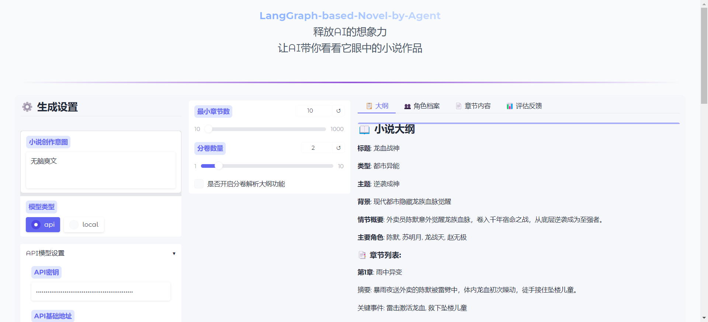
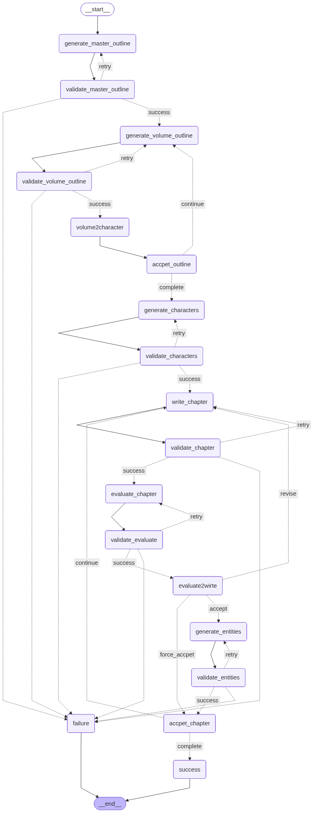
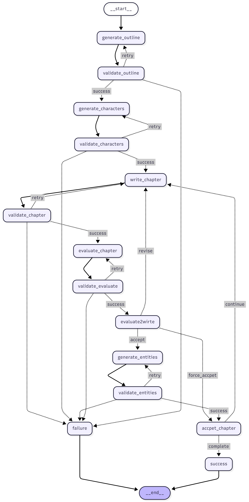

## 项目简介

本项目通过多 Agent 协作与状态管理，构建了一套完整的小说创作工作流。系统接收用户的小说创作**意图**后，自动完成大纲生成、角色档案创建、章节撰写、内容评估与修改迭代，最终输出**完整的小说内容**。核心采用 LangGraph 实现状态流转与节点协作（依赖较弱），结合本地模型完成文本生成任务。


## 目标
”老少皆宜“无论是各种设定大神（可以主动修改设定），还是就有个想法想看看AI会给你展开成什么世界观（一点不改），都可以生成一个长篇（目标1k章）的小说！

## 功能特点
- **全流程自动化**：利用 LangGraph 状态流转，实现从基于意图规划、执行、评估到完整小说生成的端到端全流程自动化
- **设计架构**：利用分层规划机制、动态重试策略、质量反馈闭环技术，结合 Plan-and-Execute 与 ReAct 双模式驱动，实现架构层面的高效协同与灵活调度
- **结构化生成**：利用 Pydantic schema 定义、JSON Schema 校验、领域专属字段约束及正则预处理技术，实现模型响应的结构化解析与各 Agent 输出的强类型 Schema 定义。
- **多 Agent 协作**：利用基于状态订阅的去中心化协同技术，结合全局不可变状态与 Agent 间事件驱动通信机制，实现多 Agent 高效协作。
- **迭代优化机制**：利用多层级验证与定向修正体系技术，实现内容生成的迭代优化机制，提升生成质量。
- **可配置参数**：利用 YAML 配置技术，实现创作策略的精细化参数化管控，支持灵活调整创作规则。
- **错误反馈**：利用可溯源的智能归因技术，实现错误反馈功能，并提供对应的解决方案提示，降低问题排查成本
- **过程可视化**：利用生成内容持久化本地存储技术，结合前端优化界面开发，实现生成过程可视化，支持实时查看大纲、角色档案、章节信息
- **模型支持**：利用本地与 API 双模式兼容技术，实现对不同部署方式模型的支持，提升场景适配性
- **Prompt工程**：利用场景化动态模板体系技术，结合分层 Prompt 模板、变量注入与 Token 优化手段，实现 Prompt 工程的高效落地，提升模型响应质量
  

## 略大一些更新の日志
2025-10-15：  基于LLM的实体识别，对每章内容提取关键结构化信息展示。具体可见生成后的./result/*_storage/entities/*_entity.json。

2025-10-13：  添加了持久化记忆，防止超长文章时的OOM。直接save and load，后续进一步分析出结构再用SQL

2025-10-12：  针对Writer的Prompt进一步优化，结构化content同时使得模型强制关注内容本身，适当弱化格式输出

2025-10-11：  大纲逻辑优化，支持更长章节的大纲生成，现在可以限制章节最少数量，以及是否开启分卷功能（使得长章节大纲效果更好）。前端同步更新。

2025-10-09:   添加API调用方式

2025-10-08： 利用gradio搭建前端，css配置样式，现在可以在前端直观看到结果以及简化的运行过程了，具体日志还可以通过terminal/log文件去查看。
使用方法（`port`为端口号，默认7999）：
```bash
python app_gradio.py --port 7999
```
## 示例（您仅仅需要输入意图，模型帮你考虑一切）


## 安装指南

### 依赖环境

- Python 3.11+
- 依赖库：`transformers`, `langgraph`, `pydantic`, `torch`

### 安装步骤

1. 克隆项目代码

```bash
git clone https://github.com/bodinggg/LangGraph-based-Novel-by-Agents.git
cd LangGraph-based-Novel-by-Agents
```

1. 安装依赖包

```bash
pip install -r requirements.txt
```

1. 准备模型
   - 需配置支持对话生成的本地模型
   - 修改`app.py`中的`model_path`为你的模型路径

## 使用方法
1. 启动应用

```bash
python app.py --model-type api or local
```
如果是使用api方式的话，记得填写.env文件。
```bash
python app_gradio.py --port 7999
```

2. 输入创作意图

```plaintext
请输入你的模型名字：** （选择api方式需要填）
请输入你的小说创作意图：例如"科幻"
```

2. 系统自动运行
   - 依次执行大纲生成、角色创建、章节撰写等流程
   - 过程日志将实时输出，并保存日志文件在`./log`
   - 最终生成完整小说内容

## 项目结构

```plaintext
my_novel/
├── assets/                # 新增：存放README图片
│   ├── gradio_interface.png  # 示例：Gradio前端界面截图
│   └── workflow_diagram.png  # 示例：工作流流程图
├──app_gradio.py         # 前端入口
├──app.py               # 终端入口，处理用户输入与启动工作流
├──config.yaml          # 配置文件，配置Agent所用模型参数
├── web/                
│   └── style.css     # gradio配置文件
└──src/
   ├── workflow.py          # 工作流定义，基于LangGraph构建节点与流转逻辑
   ├── agent.py/
   │   ├── EntityAgent            # 实体提取代理
   │   ├── OutlineGeneratorAgent  # 大纲生成代理
   │   ├── CharacterAgent         # 角色档案生成代理
   │   ├── WriterAgent            # 章节撰写代理
   │   └── ReflectAgent           # 内容评估代理
   ├── node.py              # 工作流节点函数，实现各环节具体逻辑
   ├── model.py             # 数据模型定义，基于Pydantic实现结构验证
   ├── state.py             # 全局状态管理，存储创作过程中的所有数据
   ├── storage.py           # 持久化到本地
   ├── prompt.py            # 各Agent的提示词模板
   ├── config_loader.py            # 生成参数配置（长度、温度等）
   ├── log_config.py        # 配置log文件
   └── tool.py              # 工具函数（如JSON提取）
   ```

## 核心Agent
|Agent名称|核心职责|输入输出|技术支撑与能力|
|-|-|-|-|
OutlineGeneratorAgent|基于用户意图生成结构化小说大纲（开启分卷可支持1000+章节大纲规划）|输入：用户意图；输出：JSON格式大纲|1. 支持分卷配置与章节数量保底； 2. 输出通过JSON与Pydantic结构化验证；3.精细化prompt引导，在启用分卷生成时额外有内容校验。
CharacterAgent|基于大纲生成角色档案（名称、性格、目标、冲突、成长弧线）|输入：用户意图+结构化大纲信息；输出：JSON格式角色档案|1. 输出通过JSON与Pydantic结构化验证；2. 严格验证角色档案与大纲的合理性。
WriterAgent|基于大纲+角色档案+前章实体撰写单章内容|输入：用户意图+结构化大纲+结构化角色档案+实体；输出：JSON格式内容|1.JSON格式确保生成内容正确提取；2.输出通过JSON与Pydantic结构化验证；3. 依据LLM特性与可使用信息设定超精细化Prompt。
ReflectAgent|基于大纲+角色档案+当前章节内容写出反馈内容（是否通过，得分，反馈意见，长度验证）|输入：用户意图+结构化大纲+结构化角色档案+当前章节内容；输出：JSON格式评估内容|1.输出通过JSON与Pydantic结构化验证；2.多维度对内容执行有效评估；3.可提出修改意见
EntityAgent|基于当前章节内容提取实体（角色，组织，地点，事件，其他）|输入：当前章节内容；输出：JSON格式实体内容|1.输出通过JSON与Pydantic结构化验证；2.有效提取实体信息；3.提取出的实体信息可以被LLM高效利用


## 配置说明

可通过`config.py`调整生成参数：

```python
class WriterConfig:
    max_new_tokens = 4096  # 最大生成 tokens
    temperature = 0.4      # 生成随机性（0-1，值越低越确定）
    top_p = 0.9            # 核采样参数
    min_word_length = 1000 # 最小章节长度
```

## 示例输出

生成的小说内容包含：

- 完整的小说大纲（标题、类型、章节结构等）
- 详细角色档案（背景、性格、成长弧线等）
- 各章节完整内容（符合大纲设定，角色言行一致）

## 流程图
既然能看到最后，那这个流程图也会有耐心看的（我猜）


