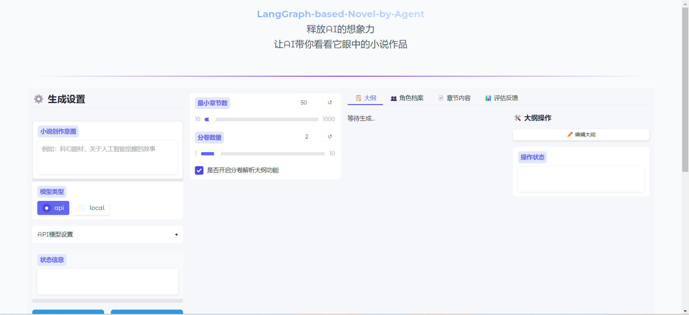
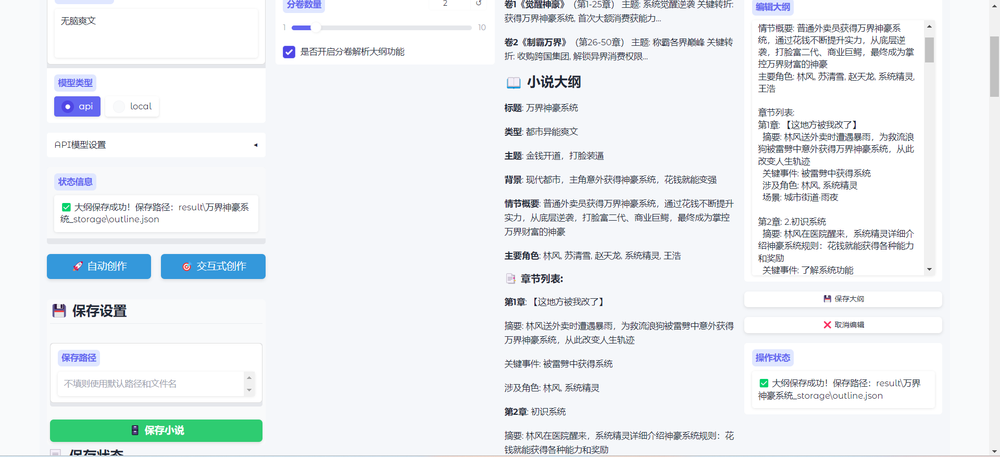
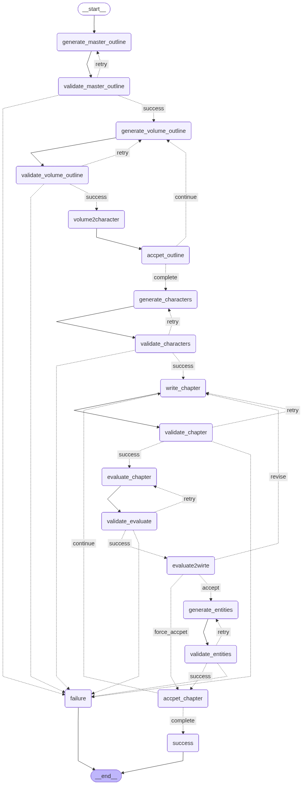
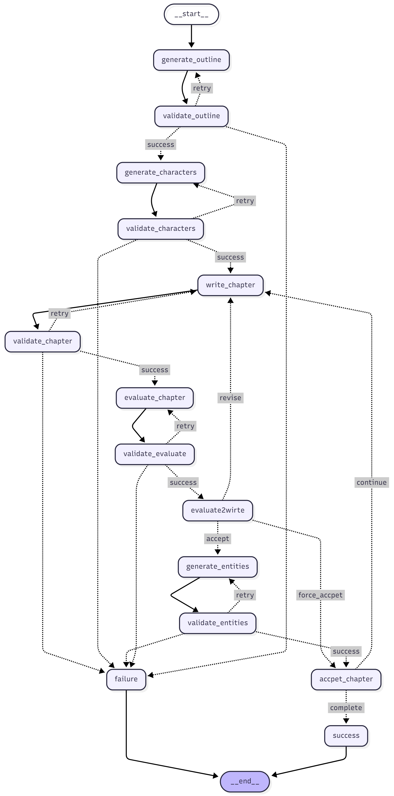

**有一些内容未更新完。还是，欢迎提Issues！--暂时复活版--**

## 项目简介

本项目通过多 Agent 协作与状态管理，构建了一套完整的小说创作工作流。系统接收用户的小说创作**意图**后，自动完成大纲生成、角色档案创建、章节撰写、内容评估与修改迭代，最终输出**完整的小说内容**。核心采用 LangGraph 实现状态流转与节点协作，结合本地模型或 API 完成文本生成任务。

## 功能特点
- **全流程自动化**：利用 LangGraph 状态流转，实现从基于意图规划、执行、评估到完整小说生成的端到端全流程自动化
- **设计架构**：利用分层规划机制、动态重试策略，质量反馈闭环技术，结合 Plan-and-Execute 与 ReAct 双模式驱动，实现架构层面的高效协同与灵活调度
- **结构化生成**：利用 Pydantic schema 定义、JSON Schema 校验、领域专属字段约束及正则预处理技术，实现模型响应的结构化解析与各 Agent 输出的强类型 Schema 定义。
- **多 Agent 协作**：利用基于状态订阅的去中心化协同技术，结合全局不可变状态与 Agent 间事件驱动通信机制，实现多 Agent 高效协作。
- **迭代优化机制**：利用多层级验证与定向修正体系技术，实现内容生成的迭代优化机制，提升生成质量。
- **可配置参数**：利用 YAML 配置技术，实现创作策略的精细化参数化管控，支持灵活调整创作规则。
- **错误反馈**：利用可溯源的智能归因技术，实现错误反馈功能，并提供对应的解决方案提示，降低问题排查成本
- **过程可视化**：利用生成内容持久化本地存储技术，结合前端优化界面开发，实现生成过程可视化，支持实时查看大纲、角色档案、章节信息
- **模型支持**：利用本地与 API 双模式兼容技术，支持 OpenAI 和 Anthropic 格式 API，提升场景适配性
- **Prompt工程**：利用场景化动态模板体系技术，结合分层 Prompt 模板、变量注入与 Token 优化手段，实现 Prompt 工程的高效落地，提升模型响应质量
- **Human-in-the-Loop**: 利用新增节点接受命令行反馈，利用中断等待接受前端反馈，实现对大纲文件编辑。
- **质量评估**：利用Reflect Agent反馈内容，结构化处理，形成json形式的评估报告，帮助了解模型对于生成内容的评估内容。
- **多端支持**：支持 CLI、Web 界面（Gradio）、API 服务三种交互方式，可扩展至桌面应用

## 目标
"老少皆宜"无论是各种设定大神（可以主动修改设定），还是就有个想法想看看AI会给你展开成什么世界观（一点不改），都可以生成一个长篇（目标1k章）的小说！

（写在目标里了直接）**因为个人体验有限，欢迎体验之后有任何问题随意提交issue，看到后有时间会第一时间改进**。

## 略大一些更新の日志

2026-04-25：  新增批量并行写作模式（`execution_mode="parallel"`），通过 `ClientPoolModelManager` 单 Key 多客户端实现真正并行；新增客户端分配日志，清晰展示每章节使用的 `client_0`~`client_3`；通过 `contextvars` 实现协程安全的客户端 ID 追踪；UI 支持批次完成后批量展示章节

2026-04-23：  新增断点恢复机制，支持从本地存储（`result/{title}_storage/`）恢复创作进度，checkpoint 作为位置指针；修复节点 skip 路径中 `novel_storage` 丢失导致 `'NoneType' object is not iterable` 错误；Gradio UI 新增"继续创作"标签页，支持从本地已生成内容继续创作；新增 `tests/unit/test_app_resume.py`、`tests/unit/test_node_resume.py` 等单元测试

2026-04-22：  新增桌面应用，使用 pywebview 封装 Gradio UI

2026-04-16：  重构架构，新增 FastAPI 服务层，支持多客户端访问；统一入口 `app_gradio.py` 同时提供 Gradio UI 和 REST API；API 支持 OpenAI 和 Anthropic 两种格式；新增 pytest 测试框架，80+ 单元/集成测试覆盖

2025-11-03：  添加质量评估结构化展示

2025-10-25:   添加角色档案+内容修改，修改逻辑有小改动

2025-10-22:   追加对会话的记录，现在logs可以看流程状态，thinking_logs可以看Agent思考过程

2025-10-21：  添加用户行为，可以主动修改大纲了。

2025-10-21：  针对Reflect Agent进一步优化，处理多种反馈情况，并适配不同模板

2025-10-15：  基于LLM的实体识别，对每章内容提取关键结构化信息展示。具体可见生成后的./result/*_storage/entities/*_entity.json。

2025-10-13：  添加了持久化记忆，防止超长文章时的OOM。直接save and load，后续进一步分析出结构再用SQL

2025-10-12：  针对Writer的Prompt进一步优化，结构化content同时使得模型强制关注内容本身，适当弱化格式输出

2025-10-11：  大纲逻辑优化，支持更长章节的大纲生成，现在可以限制章节最少数量，以及是否开启分卷功能（使得长章节大纲效果更好）。前端同步更新。

2025-10-09:   添加API调用方式

2025-10-08： 利用gradio搭建前端，css配置样式，现在可以在前端直观看到结果以及简化的运行过程了，具体日志还可以通过terminal/log文件去查看。

## 示例（您仅仅需要输入意图，模型帮你考虑一切）


## 安装指南

### 依赖环境

- Python 3.11+
- 依赖库：`transformers`, `langgraph`, `pydantic`, `torch`, `fastapi`, `gradio`

### 安装步骤

1. 克隆项目代码

```bash
git clone https://github.com/bodinggg/LangGraph-based-Novel-by-Agents.git
cd LangGraph-based-Novel-by-Agents
```

2. 安装依赖包

```bash
pip install -r requirements.txt
```

3. 配置 API（使用 API 模式需要配置）
   - 复制 `.env.example` 为 `.env`
   - 填入 `API_KEY`、`BASE_URL`、`API_TYPE`（`openai` 或 `anthropic`）

## 使用方法

### 方式一：统一服务（推荐）

同时启动 Gradio UI 和 FastAPI 服务：

```bash
python app_gradio.py
```

- Gradio UI: http://127.0.0.1:7999/ui
- API 文档: http://127.0.0.1:7999/docs

### 方式二：独立 API 服务

仅启动 FastAPI 服务，供外部客户端调用：

```bash
python app_api.py
```

- API 文档: http://127.0.0.1:8001/docs

### 方式三：命令行

```bash
python app.py --model-type api --hitl True
python app_service.py --model-type api --show-progress
```

### 方式四：桌面应用
安装桌面依赖并运行：
```bash
pip install pywebview
python desktop/app.py
```    


### API 使用示例

```bash
# 创建小说
curl -X POST http://127.0.0.1:7999/api/v1/novels \
  -H "Content-Type: application/json" \
  -d '{"user_intent": "科幻小说", "model_name": "你的模型", "min_chapters": 10}'

# 查询状态
curl http://127.0.0.1:7999/api/v1/novels/{workflow_id}
```

## 环境变量配置

使用 API 模式时，编辑 `.env` 文件：

```bash
API_KEY=your_api_key
BASE_URL=https://api.minimaxi.com/anthropic  # 或其他 API 地址
API_TYPE=anthropic  # openai 或 anthropic
```

## 项目结构

```plaintext
LangGraph-based-Novel-by-Agents/
├── assets/                    # README 图片资源
│   ├── graph_master.png       # 主工作流图
│   ├── graph.png              # 工作流图
│   └── *.png                  # Gradio 界面截图
├── app_gradio.py              # 统一入口（Gradio UI + FastAPI）
├── app_api.py                 # 独立 FastAPI 服务入口
├── app_service.py             # CLI 入口（WorkflowService）
├── app.py                     # 终端入口（Legacy）
├── config.yaml                # Agent 配置文件
├── .env.example               # 环境变量示例
├── pyproject.toml             # pytest 配置
├── requirements.txt           # 依赖包
├── ui_module/
│   └── ui.py                  # Gradio UI 模块
├── web/
│   └── style.css              # Web 样式
├── src/
│   ├── workflow.py            # LangGraph 工作流定义
│   ├── agent.py               # 5 个核心 Agent
│   ├── node.py                # 工作流节点函数
│   ├── model.py               # Pydantic 数据模型
│   ├── state.py               # 全局状态管理
│   ├── storage.py             # 本地持久化
│   ├── prompt.py              # Agent 提示词模板
│   ├── enhanced_prompts.py     # 评估反馈分支模板
│   ├── feedback_processor.py  # 反馈分支处理
│   ├── evaluation_reporter.py # 评估报告生成
│   ├── feedback_nodes.py      # 审查节点（用户输入）
│   ├── config_loader.py       # YAML 配置加载
│   ├── log_config.py          # 日志配置
│   ├── thinking_logger.py     # Agent 会话记录
│   ├── tool.py                # 工具函数（JSON提取等）
│   ├── model_manager.py       # 模型管理（OpenAI/Anthropic）
│   ├── show.py                # 展示函数
│   ├── core/                  # 核心服务
│   │   ├── workflow_service.py
│   │   ├── state_manager.py
│   │   └── progress.py
│   └── api/                   # FastAPI 服务
│       ├── models.py
│       ├── routes.py
│       └── websocket_manager.py
├── tests/                     # 测试目录
│   ├── conftest.py            # pytest fixtures
│   ├── unit/                  # 单元测试
│   │   ├── test_tool.py
│   │   ├── test_model.py
│   │   ├── test_feedback_processor.py
│   │   ├── test_evaluation_reporter.py
│   │   ├── test_model_manager.py
│   │   └── test_core.py
│   └── integration/           # 集成测试
│       └── test_storage.py
├── result/                    # 生成结果存储（示例数据）
├── thinking_logs/              # Agent 思考过程日志
├── desktop/                   # 桌面应用
    │   ├── app.py                # pywebview 桌面入口
    │   ├── static/               # 自定义静态资源
    │   └── templates/            # HTML 模板
```

## 核心Agent
|Agent名称|核心职责|输入输出|技术支撑与能力|
|-|-|-|-|
OutlineGeneratorAgent|基于用户意图生成结构化小说大纲（开启分卷可支持1000+章节大纲规划）|输入：用户意图；输出：JSON格式大纲|1. 支持分卷配置与章节数量保底； 2. 输出通过JSON与Pydantic结构化验证；3.精细化prompt引导，在启用分卷生成时额外有内容校验。
CharacterAgent|基于大纲生成角色档案（名称、性格、目标、冲突、成长弧线）|输入：用户意图+结构化大纲信息；输出：JSON格式角色档案|1. 输出通过JSON与Pydantic结构化验证；2. 严格验证角色档案与大纲的合理性。
WriterAgent|基于大纲+角色档案+前章实体撰写单章内容|输入：用户意图+结构化大纲+结构化角色档案+实体；输出：JSON格式内容|1.JSON格式确保生成内容正确提取；2.输出通过JSON与Pydantic结构化验证；3. 依据LLM特性与可使用信息设定超精细化Prompt。
ReflectAgent|基于大纲+角色档案+当前章节内容写出反馈内容（是否通过，得分，反馈意见，长度验证）|输入：用户意图+结构化大纲+结构化角色档案+当前章节内容；输出：JSON格式评估内容|1.输出通过JSON与Pydantic结构化验证；2.多维度对内容执行有效评估；3.可提出修改意见
EntityAgent|基于当前章节内容提取实体（角色，组织，地点，事件，其他）|输入：当前章节内容；输出：JSON格式实体内容|1.输出通过JSON与Pydantic结构化验证；2.有效提取实体信息；3.提取出的实体信息可以被LLM高效利用


## 配置说明

可通过`config.yaml`调整生成参数：

```yaml
outline_config:
  max_new_tokens: 4096
  temperature: 0.9
  min_chapters: 30
  volume: 2              # 分卷数
  master_outline: True   # 是否启用分卷大纲

writer_config:
  max_new_tokens: 4096
  temperature: 0.4
```

## 示例输出

生成的小说内容包含：

- 完整的小说大纲（标题、类型、章节结构等）
- 详细角色档案（背景、性格、成长弧线等）
- 各章节完整内容（符合大纲设定，角色言行一致）

## 测试

```bash
# 安装测试依赖
pip install pytest pytest-mock pytest-cov

# 运行所有测试
pytest tests/ -v

# 运行测试并查看覆盖率
pytest tests/ -v --cov=src --cov-report=term-missing

# 运行单元测试
pytest tests/unit/ -v

# 运行集成测试
pytest tests/integration/ -v
```

测试目录结构：
- `tests/conftest.py` - pytest fixtures 和共享配置
- `tests/unit/` - 单元测试（工具函数、数据模型、反馈处理等）
- `tests/integration/` - 集成测试（存储、工作流等）

## 流程图
既然能看到最后，那这个流程图也会有耐心看的（我猜）


